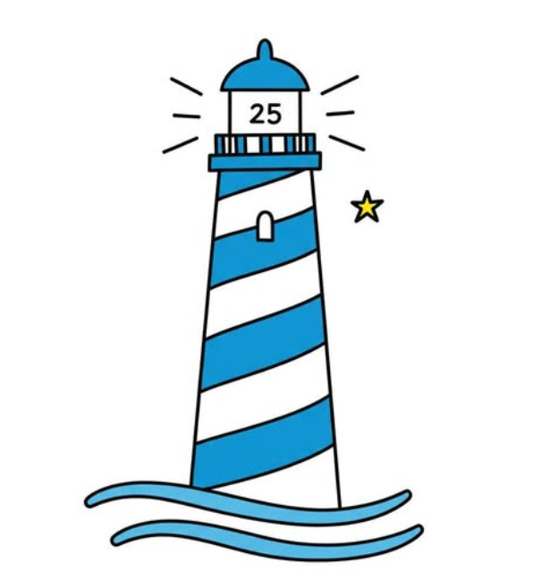

  

# 🌐 **Marina – Sito Django Faro25**

Progetto Django sviluppato da **Michelangelo Zanelli**, parte del portale *Faro25.it*.  
Il sito unisce struttura editoriale e gestione dinamica dei contenuti attraverso il framework **Django**.

---

## ⚙️ Stack Tecnologico
- Python 3.11  
- Django 4.2  
- Gunicorn + Nginx (deploy online)
- SQLite / MySQL (database)
- HTML5 / CSS3 / Bootstrap (frontend)
- ReportLab (generazione PDF)

---

## 🚀 Funzionalità Principali
- Area Admin personalizzata  
- Gestione articoli, eventi e sezioni tematiche  
- Sitemap automatica e SEO integrata  
- Gestione immagini e allegati  
- Struttura modulare per future estensioni  

---

## 🧩 Stato attuale
Il progetto è stato recuperato, ripulito e testato in ambiente locale con Django 4.2.26.  
La repository è pubblica per scopi di studio, portfolio e dimostrazione tecnica.

---

## 📸 Screenshot
*(Puoi aggiungere immagini della home o dell’admin quando vuoi)*

---

## 👨‍💻 Autore
**Michelangelo Zanelli**  
Logopedista · Giornalista · Sviluppatore Python/Django  
📧 [supporto.francadys@gmail.com](mailto:supporto.francadys@gmail.com)  
🌐 [faro25.it](https://www.faro25.it)

---

## 📄 Licenza
© 2025 Michelangelo Zanelli — Tutti i diritti riservati.  
Distribuito a scopo dimostrativo, non destinato alla ridistribuzione commerciale.
